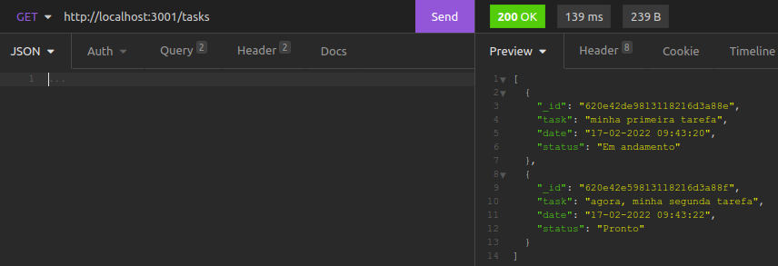
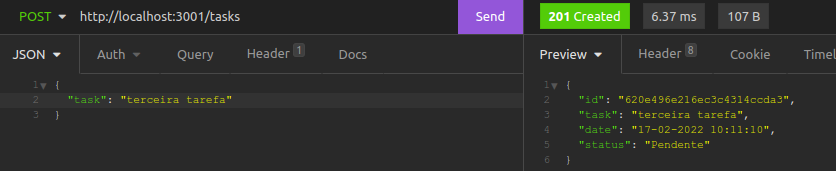
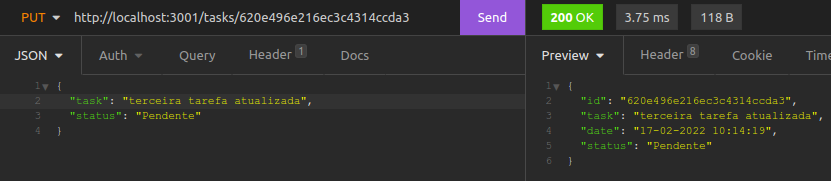
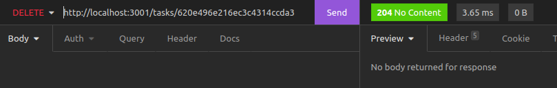
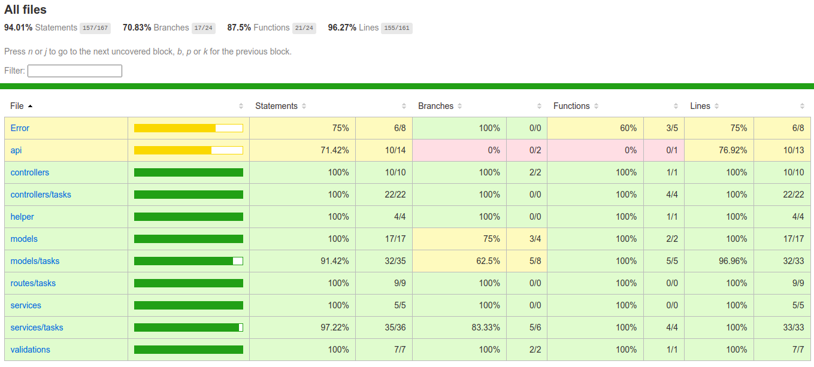
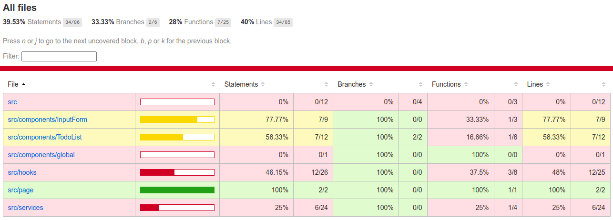

# Boas vindas ao repositório do projeto TodoMERN!

Esse projeto foi desenvolvido com MERN: MongoDB, Express, React, NodeJS.
O propósito é criar uma lista de tarefa full stack com as tecnologias acima.

O projeto TodoMERN, simula uma lista de tarefas onde cada tarefa adicionada, cada alteração e exclusão são enviados ao banco de dados através do back-end e são retornados ao front-end para visualização do usuário.

  
  
  
  
  

# Sumário

- [Instruções](#instruções)
- [Entender o projeto](#entender-o-projeto)
- [Back-end](#back-end)
  - [GET tasks](#get-tasks)
  - [POST tasks](#post-tasks)
  - [PUT tasks/id](#put-tasksid)
  - [DELETE tasks/id](#delete-tasksid)
- [Front-end](#front-end)
- [Testes](#testes)
- [Avisos Finais](#avisos-finais)
- [Obrigado](#obrigado)
- [Contato](#contato)

---

&nbsp

# 👀 Instruções:

Entre na raiz de cada projeto (back, front) e utilize o comando:

~~~
npm install
~~~

---

dica: use 'npm run dev' para back-end e 'npm start' para front-end!

&nbsp

# Entender o projeto

Na página principal:

O acesso se dará pelo 'localhost:3000', lá terá um campo para preenchimento e um botão de envio:

O primeiro campo de preenchimento deverá receber a tarefa a ser adicionada.

O botão será para enviar a tarefa e exibi-la na tela.

Após o envio da tarefa, a mesma será exibida na tela com botões para alterar o status e por fim, terá um icone para exclusão da tarefa!

&nbsp

# Back-end

Use o comando na pasta 'back-end':

~~~
npm run dev
~~~

O back-end conta com rotas para criação, leitura, alteração e remoção (CRUD: create, read, update, delete) de tarefas no banco de dados. Veja a resposta para cada rota:

## GET tasks

## POST tasks

## PUT tasks/id

## DELETE tasks/id

&nbsp

# Front-end

Veja como fica a aplicação sendo usada pelo front-end:

&nbsp

# Testes

Esse projeto conta com testes de integração para garantir boa funcionalidade e redução de comportamentos inesperados, segue cobertura de teste:

Back-end:

Front-end:

dica: para mais informações, use os comandos 'npm test', 'npm test:coverage' ou 'npm test:coverage:report' dentro de cada projeto.

# Avisos Finais

Há algumas implementações a serem feitas e elas estão no radar, com pouco uso da aplicação verá que falta ajustes. A ampliação de cobertura de testes é um dos passos a serem seguidos.

&nbsp

# Obrigado

Obrigado por acompanharem até aqui e que este repositório possa servir de base para outros projetos!

&nbsp

# Contato

  <a href = "mailto:artur.alvaro73@gmail.com">
   

